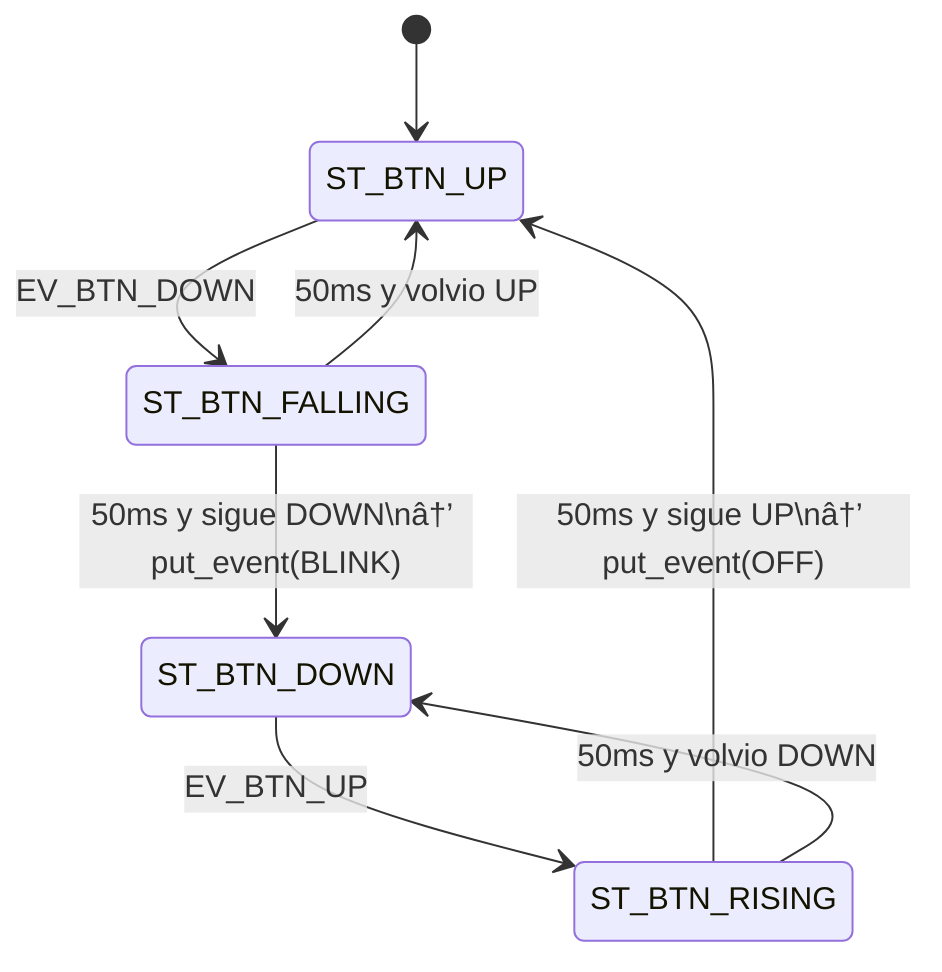
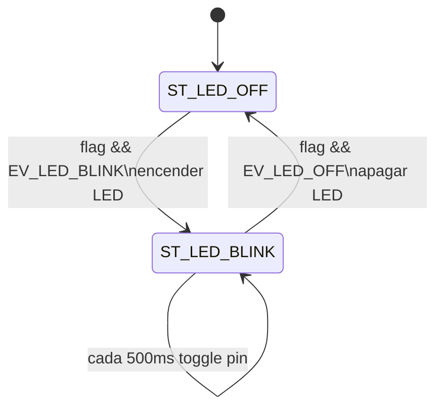

# CESE - Sistemas Operativos de Tiempo Real

## Trabajo Practico N°: 2 - Comunicacion de Tareas de FreeRTOS

> **Nota sobre archivos de la guia:** la consigna original cita `startup_stm32f103rbtx.s`, `stm32f1xx_it.c` (NUCLEO-F103).  
> Este proyecto del grupo usa **STM32L4R5ZI** (NUCLEO-L4R5ZI). Los archivos equivalentes analizados son:
>
>
> | Guia (F103)               | Proyecto real (L4R5)                                            |
> | ------------------------- | --------------------------------------------------------------- |
> | `startup_stm32f103rbtx.s` | `Core/Startup/startup_stm32l4r5zitx.s`                          |
> | `stm32f1xx_it.c`          | `Core/Src/stm32l4xx_it.c`                                       |
> | `main.c`                  | `Core/Src/main.c`                                               |
> | `FreeRTOSConfig.h`        | `Core/Inc/FreeRTOSConfig.h`                                     |
> | `freertos.c`              | `Core/Src/freertos.c` (+ hooks fuertes en `APP/src/freertos.c`) |
>
>
> **Nota sobre TIM1 / TIM2 en la consigna:** el texto de la guia mezcla nombres (*"Timer 1 (TIM2)"*, *"Timer 2 (TIM2)"*).  
> En **este** firmware la asignacion verificada es:
>
> - **SysTick** → tick del kernel **FreeRTOS** (1 ms).
> - **TIM1** → timebase de la **HAL** (`uwTick`, 1 ms).
> - **TIM2** → contador de alta frecuencia para **run-time stats** de FreeRTOS (`ulHighFrequencyTimerTicks`).

---

## 1) Analisis y explicacion del codigo fuente base (Core)

### 1.1 Funcionamiento general de los archivos Core

#### `startup_stm32l4r5zitx.s`

Es el **vector de interrupciones** y el **punto de entrada** tras reset del Cortex-M4.

Responsabilidades principales:

1. Tabla `g_pfnVectors`: apunta `_estack`, `Reset_Handler`, handlers de excepciones (NMI, HardFault, …) y de perifericos (TIM1, TIM2, EXTI, …).
2. `Reset_Handler`:
  - Configura SP (`_estack`).
  - Llama `SystemInit()` (FPU, VTOR si aplica).
  - Copia `.data` desde Flash a RAM.
  - Pone `.bss` en cero.
  - Llama `__libc_init_array()` (constructores estaticos C).
  - Llama `main()`.
3. Si `main()` retornara, cae en `LoopForever`.

En el vector aparecen entradas relevantes para este TP2:

- `SysTick_Handler` (pos. 15) — usado por FreeRTOS tras `osKernelStart()`.
- `TIM1_UP_TIM16_IRQHandler` — timebase HAL.
- `TIM2_IRQHandler` — contador run-time stats.
- `EXTI15_10_IRQHandler` — boton B1 (PC13).

#### `main.c`

Orquesta la inicializacion **antes** del scheduler:

```text
main()
  ├─ [opcional] initialise_monitor_handles()   (semihosting)
  ├─ HAL_Init()                                → HAL_InitTick() usa TIM1
  ├─ SystemClock_Config()                      → PLL, 120 MHz SYSCLK
  ├─ MX_GPIO_Init()                            → LED, boton EXTI, USB
  ├─ MX_LPUART1_UART_Init()
  ├─ MX_USART3_UART_Init()
  ├─ MX_TIM2_Init()                            → Prescaler=119, Period=99
  ├─ HAL_TIM_Base_Start_IT(&htim2)             → arranca TIM2 con IRQ
  ├─ app_init()                                → cola, semaforo, task_btn, task_led
  └─ osKernelStart()                           → arranca FreeRTOS (no retorna)
       └─ while(1) {}                          → codigo muerto si scheduler OK
```

`HAL_TIM_PeriodElapsedCallback()` discrimina instancia:

- **TIM1** → `HAL_IncTick()` incrementa `uwTick` (HAL, 1 ms).
- **TIM2** → `ulHighFrequencyTimerTicks++` (stats FreeRTOS).

Funciones auxiliares para stats (`configureTimerForRunTimeStats`, `getRunTimeCounterValue`) estan en `main.c` y se enlazan desde `FreeRTOSConfig.h`.

#### `stm32l4xx_it.c`

Capa de **vectores de interrupcion** que delega en HAL:


| Handler                           | Accion                                           |
| --------------------------------- | ------------------------------------------------ |
| Excepciones Cortex (HardFault, …) | Loop infinito / depuracion                       |
| `TIM1_UP_TIM16_IRQHandler`        | `HAL_TIM_IRQHandler(&htim1)` → callback HAL tick |
| `TIM2_IRQHandler`                 | `HAL_TIM_IRQHandler(&htim2)` → incremento stats  |
| `EXTI15_10_IRQHandler`            | `HAL_GPIO_EXTI_IRQHandler(B1_Pin)` → `app_it.c`  |


No contiene logica de aplicacion; solo despacha a HAL/callbacks.

#### `FreeRTOSConfig.h`

Parametriza el kernel para este proyecto:


| Define                                         | Valor             | Efecto en TP2                          |
| ---------------------------------------------- | ----------------- | -------------------------------------- |
| `configUSE_PREEMPTION`                         | 1                 | Scheduler preemptivo                   |
| `configTICK_RATE_HZ`                           | 1000              | Tick RTOS = 1 ms                       |
| `configCPU_CLOCK_HZ`                           | `SystemCoreClock` | Base para calcular SysTick             |
| `configTOTAL_HEAP_SIZE`                        | 15360             | Heap para tareas, colas, semaforos     |
| `configUSE_IDLE_HOOK`                          | 1                 | Hook idle activo (`APP/freertos.c`)    |
| `configUSE_TICK_HOOK`                          | 1                 | Hook tick activo                       |
| `configCHECK_FOR_STACK_OVERFLOW`               | 1                 | Deteccion desborde pila                |
| `configGENERATE_RUN_TIME_STATS`                | 1                 | Stats CPU por tarea                    |
| `INCLUDE_vTaskDelayUntil`                      | 1                 | Usado en `task_led`                    |
| `configLIBRARY_MAX_SYSCALL_INTERRUPT_PRIORITY` | 5                 | Limite IRQ que pueden usar API FromISR |
| `xPortSysTickHandler`                          | `SysTick_Handler` | FreeRTOS toma SysTick (HAL usa TIM1)   |


Macros de run-time stats:

```c
#define portCONFIGURE_TIMER_FOR_RUN_TIME_STATS configureTimerForRunTimeStats
#define portGET_RUN_TIME_COUNTER_VALUE         getRunTimeCounterValue
```

TIM2 alimenta esas macros con resolucion ~100 us (10 kHz).

#### `freertos.c` (Core)

Generado por CubeMX. Aporta:

- Stubs `__weak` de hooks y funciones de stats (sobreescritos en `APP/src/freertos.c`).
- `vApplicationGetIdleTaskMemory()` — **alloc estatica** de la tarea Idle (TCB + stack).

Las implementaciones reales de hooks estan en `APP/src/freertos.c`:

- `vApplicationIdleHook()` → `g_task_idle_cnt++`
- `vApplicationTickHook()` → `g_app_tick_cnt++`
- `vApplicationStackOverflowHook()` → `configASSERT(0)`

---

### 1.2 Evolucion de `SystemCoreClock` y SysTick (desde `Reset_Handler` hasta `while(1)` de `main`)

#### `SystemCoreClock`

Variable global CMSIS (`system_stm32l4xx.c`):

```c
uint32_t SystemCoreClock = 4000000U;  /* valor inicial tras reset (MSI 4 MHz tipico) */
```


| Etapa                             | Valor / accion                                                   | Archivo              |
| --------------------------------- | ---------------------------------------------------------------- | -------------------- |
| Reset                             | `4000000` (4 MHz, MSI por defecto)                               | `system_stm32l4xx.c` |
| `SystemInit()` en `Reset_Handler` | Configura FPU; **no** cambia PLL todavia                         | `system_stm32l4xx.c` |
| `HAL_Init()`                      | Llama `HAL_InitTick()`; usa `SystemCoreClock` vigente            | `main.c`             |
| `SystemClock_Config()`            | PLL: HSI 16 MHz → PLLM=2, PLLN=30, PLLR=2 → **SYSCLK = 120 MHz** | `main.c`             |
| Tras `HAL_RCC_ClockConfig()`      | `SystemCoreClock` actualizado automaticamente a **120000000**    | HAL RCC              |


Calculo PLL (verificado en `SystemClock_Config`):

```text
VCO_in  = HSI / PLLM = 16 MHz / 2 = 8 MHz
VCO_out = VCO_in * PLLN = 8 * 30 = 240 MHz
SYSCLK  = VCO_out / PLLR = 240 / 2 = 120 MHz
HCLK    = 120 MHz (AHB div 1)
PCLK1   = 60 MHz (APB1 div 2)  → TIM2 clock efectivo 120 MHz (x2 si APB prescaled)
PCLK2   = 120 MHz (APB2 div 1) → TIM1 clock 120 MHz
```

#### SysTick (periferico Cortex-M)


| Etapa                                          | Estado de SysTick                                                                                                                   |
| ---------------------------------------------- | ----------------------------------------------------------------------------------------------------------------------------------- |
| Tras reset                                     | No configurado (registros LOAD/VAL/CTRL en estado por defecto)                                                                      |
| Durante `HAL_Init()`                           | **No** se usa SysTick para HAL tick; CubeMX redirige tick HAL a **TIM1** (`stm32l4xx_hal_timebase_tim.c`)                           |
| Durante init perifericos                       | SysTick sigue sin rol activo en aplicacion                                                                                          |
| En `osKernelStart()` → `vTaskStartScheduler()` | Port FreeRTOS **configura SysTick** para interrumpir cada 1 ms (`configTICK_RATE_HZ = 1000`) usando `SystemCoreClock = 120 MHz`     |
| Tras arranque scheduler                        | `SysTick_Handler` (alias `xPortSysTickHandler`) incrementa tick RTOS; habilita `vTaskDelay`, `vTaskDelayUntil`, `xTaskGetTickCount` |


**Variable relacionada `uwTick` (HAL):** no es SysTick; es contador software incrementado en callback de **TIM1** cada 1 ms via `HAL_IncTick()`. Se usa en delays HAL (`HAL_Delay`) y base temporal HAL.

**Resumen temporal:**

```text
SystemCoreClock:  4 MHz ──SystemClock_Config()──► 120 MHz (permanece)
uwTick (HAL):       0 ──TIM1 IRQ cada 1 ms──────► 0, 1, 2, 3 …
SysTick (RTOS):   inactivo ──osKernelStart()──► tick 0, 1, 2 … (1 ms)
ulHighFrequencyTimerTicks: 0 ──TIM2 IRQ ~100 us──► contador rapido
```

---

### 1.3 Comportamiento del programa desde `Reset_Handler` hasta **antes** del `while(1)` de `main`

Secuencia detallada (sin scheduler aun):

```text
1. Reset hardware
   └─ CPU carga SP desde vector[0] y PC desde vector[1] = Reset_Handler

2. Reset_Handler (startup_stm32l4r5zitx.s)
   ├─ sp = _estack
   ├─ SystemInit()           → FPU, VTOR
   ├─ Copia .data Flash→RAM
   ├─ Limpia .bss = 0
   ├─ __libc_init_array()
   └─ main()

3. main() — fase bare-metal (aun no hay tareas RTOS)
   ├─ initialise_monitor_handles()  [si semihosting]
   ├─ HAL_Init()
   │    └─ HAL_InitTick() → configura TIM1 @ 1 ms, NVIC TIM1_UP_TIM16
   ├─ SystemClock_Config()
   │    └─ SystemCoreClock = 120 MHz; HAL_InitTick() reconfigura TIM1
   ├─ MX_GPIO_Init()        → LEDs, B1 como EXTI falling, prioridad IRQ 5
   ├─ MX_LPUART1 / MX_USART3
   ├─ MX_TIM2_Init()        → timer base 10 kHz (stats)
   ├─ HAL_TIM_Base_Start_IT(&htim2)
   │    └─ empiezan IRQ de TIM2 (ulHighFrequencyTimerTicks++)
   └─ app_init()
        ├─ Inicializa contadores globales (g_app_cnt, …)
        ├─ xQueueCreate(5, sizeof(task_led_ev_t))
        ├─ xSemaphoreCreateBinary()
        ├─ xTaskCreate(task_btn, … prio 1)
        ├─ xTaskCreate(task_led, … prio 1)
        ├─ app_it_init()
        └─ cycle_counter_init()

4. osKernelStart()
   ├─ Crea tarea Idle (memoria estatica en Core/freertos.c)
   ├─ Configura SysTick para tick 1 ms
   ├─ Arranca primera tarea lista (task_btn o task_led segun scheduler)
   └─ NO RETORNA a main()

5. while(1) en main → NO se alcanza en operacion normal
```

**Comportamiento observable antes del `while(1)`:**

- Reloj del sistema a **120 MHz**.
- **TIM1** generando interrupciones cada 1 ms (`uwTick` avanza).
- **TIM2** generando interrupciones cada ~100 us (`ulHighFrequencyTimerTicks` avanza).
- Tareas `Task BTN` y `Task LED` **creadas** en memoria/heap pero **aun no ejecutadas** hasta `osKernelStart()`.
- Cola y semaforo creados pero **no usados** aun por las tareas (comunicacion actual: variable compartida).

---

### 1.4 Como y para que interactuan SysTick y TIM1/TIM2 con FreeRTOS

La consigna mezcla numeracion; esta tabla refleja el **proyecto real**:


| Recurso     | Interaccion con FreeRTOS                                                                                                                                                | Para que                                                                                                                       |
| ----------- | ----------------------------------------------------------------------------------------------------------------------------------------------------------------------- | ------------------------------------------------------------------------------------------------------------------------------ |
| **SysTick** | El port Cortex-M configura SysTick al iniciar scheduler. Cada IRQ ejecuta el tick handler del kernel (`xPortSysTickHandler`).                                           | **Tick RTOS 1 ms**: `vTaskDelay`, `vTaskDelayUntil`, timeouts de colas/semaforos, `xTaskGetTickCount`, `vApplicationTickHook`  |
| **TIM1**    | **No** es tick de FreeRTOS. Convive en paralelo. FreeRTOS puede suspender/reanudar tick HAL con `HAL_SuspendTick`/`HAL_ResumeTick` en context switches (segun port ST). | **Timebase HAL** (`uwTick`): delays HAL, timeouts HAL. Libera SysTick para el kernel                                           |
| **TIM2**    | Con `configGENERATE_RUN_TIME_STATS = 1`, el kernel lee `getRunTimeCounterValue()` → `ulHighFrequencyTimerTicks`                                                         | **Run-time stats**: medir % CPU por tarea (Tracealyzer, `vTaskGetRunTimeStats`, debug). Resolucion ~100 us vs 1 ms del SysTick |


Cadena TIM2 → FreeRTOS stats:

```text
TIM2 IRQ (10 kHz)
  → TIM2_IRQHandler()
  → HAL_TIM_IRQHandler(&htim2)
  → HAL_TIM_PeriodElapsedCallback(TIM2)
  → ulHighFrequencyTimerTicks++
  → portGET_RUN_TIME_COUNTER_VALUE (en context switch / stats API)
```

Cadena SysTick → FreeRTOS:

```text
SysTick IRQ (1 kHz)
  → SysTick_Handler / xPortSysTickHandler
  → xTaskIncrementTick()
  → vApplicationTickHook()  [g_app_tick_cnt++ en APP/freertos.c]
  → posible cambio de contexto (PendSV)
```

**Comparacion baremetal:** en un proyecto sin RTOS, SysTick suele servir para `HAL_IncTick()` y nada mas. Aqui **SysTick queda reservado al kernel** y la HAL usa **TIM1**, evitando competir por el mismo timer.

---

### 1.5 Como y para que TIM2 interactua con la HAL del proyecto

TIM2 se usa **a traves de la HAL**, pero **no** como reloj principal de la HAL (ese rol es de TIM1).

#### Configuracion (`MX_TIM2_Init` en `main.c`)

```c
htim2.Init.Prescaler = 119;   /* div 120 → 1 MHz contador si TIMclk = 120 MHz */
htim2.Init.Period    = 99;    /* overflow cada 100 cuentas → 10 kHz */
```

Frecuencia de update (con TIM2 clock = 120 MHz):

```text
f_TIM2 = 120 MHz / (119+1) / (99+1) = 10 kHz  →  periodo 100 us
```

#### Cadena HAL

```text
main: HAL_TIM_Base_Start_IT(&htim2)
  → HAL habilita IRQ TIM2
stm32l4xx_it.c: TIM2_IRQHandler()
  → HAL_TIM_IRQHandler(&htim2)
main.c: HAL_TIM_PeriodElapsedCallback()  [if TIM2]
  → ulHighFrequencyTimerTicks++
```

#### Proposito respecto a la HAL


| Aspecto              | TIM1 (HAL tick)                              | TIM2 (aplicacion)                                                |
| -------------------- | -------------------------------------------- | ---------------------------------------------------------------- |
| API HAL usada        | `HAL_InitTick`, `HAL_IncTick`, `HAL_GetTick` | `HAL_TIM_Base_Init`, `HAL_TIM_Base_Start_IT`, callback periodico |
| Variable actualizada | `uwTick` (ms)                                | `ulHighFrequencyTimerTicks` (100 us)                             |
| Consumidor principal | Delays HAL, timeouts                         | FreeRTOS run-time stats                                          |
| Iniciado en          | `HAL_Init()` / `SystemClock_Config()`        | `main()` usuario, antes de `app_init()`                          |


TIM2 demuestra el patron HAL de **timer base en modo interrupcion**: el hardware cuenta, la HAL despacha IRQ, el usuario implementa accion minima en callback. Es el mismo patron que usara EXTI del boton en TP2-04, pero con proposito de medicion y no de logica de boton.

**Importante:** TIM2 **no** reemplaza a SysTick ni a TIM1. Los tres coexisten:

```text
TIM1  → 1 ms   → HAL
SysTick → 1 ms → FreeRTOS kernel
TIM2  → 100 us → estadisticas CPU (FreeRTOS)
```

---

### 1.6 Diagrama de arranque (Core)

```mermaid
flowchart TD
    R[Reset_Handler] --> SI[SystemInit]
    SI --> DATA[Copia .data / limpia .bss]
    DATA --> LIBC[__libc_init_array]
    LIBC --> M[main]

    M --> HAL[HAL_Init → TIM1 1ms HAL tick]
    HAL --> CLK[SystemClock_Config → 120 MHz]
    CLK --> PER[MX_GPIO / UART / TIM2]
    PER --> T2[HAL_TIM_Base_Start_IT TIM2]
    T2 --> APP[app_init → tareas + cola + sem]
    APP --> OS[osKernelStart]
    OS --> SYST[Configura SysTick 1ms RTOS]
    SYST --> RUN[Tareas Task BTN / Task LED]

    M --> W[while 1 - no alcanzado]
```




---

### 1.7 Puntos de verificacion en depuracion (Paso 07 de la guia)

Para confirmar este analisis en STM32CubeIDE:

1. Breakpoint en `Reset_Handler` y single-step hasta `main`.
2. Watch `SystemCoreClock` antes y despues de `SystemClock_Config()` → debe pasar a `120000000`.
3. Breakpoint en `TIM1_UP_TIM16_IRQHandler` → `uwTick` incrementa cada ~1 ms.
4. Breakpoint en `TIM2_IRQHandler` → `ulHighFrequencyTimerTicks` incrementa ~ cada 100 us.
5. Breakpoint en `osKernelStart()` → al continuar, el flujo **no** vuelve a `while(1)`.
6. Breakpoint en `SysTick_Handler` tras scheduler → tick RTOS activo.
7. Vista FreeRTOS/tasks: `Task BTN`, `Task LED`, `IDLE` presentes.

---

*Seccion 1 — Actividad TP2-01, Paso 06. Proyecto: `sotri-tp2_01_26Co2026-07`. Placa: NUCLEO-L4R5ZI.*

---

## 2) Analisis y explicacion del codigo fuente de aplicacion (APP)

> **Archivos analizados** (Paso 08 de la guia):
>
>
> | Archivo guia           | Ruta en el proyecto            |
> | ---------------------- | ------------------------------ |
> | `app.c`                | `APP/src/app.c`                |
> | `app_it.c`             | `APP/src/app_it.c`             |
> | `task_btn.c`           | `APP/src/task_btn.c`           |
> | `task_led.c`           | `APP/src/task_led.c`           |
> | `task_led_interface.c` | `APP/src/task_led_interface.c` |
> | `freertos.c`           | `APP/src/freertos.c`           |
>
>
> **Nota:** existe tambien `Core/Src/freertos.c` con stubs debiles de CubeMX. Las implementaciones **activas** de hooks estan en `APP/src/freertos.c` (sobreescriben los stubs).

---

### 2.1 Vision general: sistema orientado a eventos (ETS)

El demo implementa un **Event-Triggered System** con dos tareas FreeRTOS de igual prioridad:

```text
                    +------------------+
                    |     app_init     |
                    | cola + sem +     |
                    | task_btn/led     |
                    +--------+---------+
                             |
              +--------------+--------------+
              |                             |
       +------v------+               +------v------+
       |  task_btn   |  evento     |  task_led   |
       |  (prod.)    +------------>|  (cons.)    |
       |  polling    | put_event   |  GPIO LED   |
       +-------------+             +-------------+
              ^                             |
              |                             v
         HAL_GPIO_ReadPin              LD2 ON/OFF/BLINK
         cada 50 ms
```

**Comportamiento funcional verificado:**


| Accion usuario                     | Evento generado | Efecto en LED                          |
| ---------------------------------- | --------------- | -------------------------------------- |
| Boton libre                        | —               | LED apagado (`ST_LED_OFF`)             |
| Boton presionado estable (≥ 50 ms) | `EV_LED_BLINK`  | Entra en parpadeo (toggle cada 500 ms) |
| Boton soltado estable (≥ 50 ms)    | `EV_LED_OFF`    | LED apagado                            |


Secuencia tipica en UART:

```text
Task BTN - BTN PRESSED  →  Task LED - LED BLINK
Task BTN - BTN HOVER    →  Task LED - LED OFF
```

---

### 2.2 `app.c` — inicializacion de la aplicacion

#### Rol

Punto de entrada de la capa APP. Es llamado desde `main()` **antes** de `osKernelStart()`. Centraliza creacion de primitivas RTOS, tareas y servicios auxiliares.

#### Variables globales


| Variable                         | Tipo                | Proposito                                                     |
| -------------------------------- | ------------------- | ------------------------------------------------------------- |
| `g_app_cnt`, `g_app_task_cnt`, … | `uint32_t`          | Contadores de observabilidad / debug                          |
| `h_btn_led_q`                    | `QueueHandle_t`     | Cola BTN→LED (5 x `task_led_ev_t`) — **creada, no usada aun** |
| `h_btn_led_bin_sem`              | `SemaphoreHandle_t` | Semaforo binario — **creado, no usado aun**                   |
| `h_task_btn`, `h_task_led`       | `TaskHandle_t`      | Handles para depuracion o borrado futuro                      |


#### Secuencia de `app_init()`

```text
app_init()
  ├─ Inicializa contadores globales a 0
  ├─ LOGGER_INFO: banner ETS / TP2
  ├─ xQueueCreate(5, sizeof(task_led_ev_t))  → h_btn_led_q
  ├─ vQueueAddToRegistry(...)                  → debug/trace
  ├─ xSemaphoreCreateBinary()                → h_btn_led_bin_sem
  ├─ vQueueAddToRegistry(...)
  ├─ xTaskCreate(task_btn, "Task BTN", prio 1, &h_task_btn)
  ├─ xTaskCreate(task_led, "Task LED", prio 1, &h_task_led)
  ├─ xPortGetFreeHeapSize()                  → heap restante
  ├─ app_it_init()
  └─ cycle_counter_init()                    → DWT para mediciones
```

#### Parametros de creacion de tareas

Ambas tareas comparten configuracion simetrica:


| Parametro | Valor                                         | Significado                        |
| --------- | --------------------------------------------- | ---------------------------------- |
| Stack     | `2 * configMINIMAL_STACK_SIZE` (256 palabras) | Pila por tarea                     |
| Prioridad | `tskIDLE_PRIORITY + 1` (= 1)                  | Mayor que Idle (0), igual entre si |
| Parametro | `NULL`                                        | Sin argumento al handler           |


`configASSERT` verifica creacion exitosa de cola, semaforo y tareas.

#### Estado respecto a actividades futuras del TP2

La cola y el semaforo estan **preparados** para TP2-02 (cola) y TP2-03/04 (semaforo), pero en TP2-01 la comunicacion real va por `put_event_task_led()` (memoria compartida). Esto es intencional del material del curso.

---

### 2.3 `app_it.c` — interrupciones de aplicacion

#### Rol

Capa de callbacks de interrupcion entre HAL (`stm32l4xx_it.c`) y logica de aplicacion.

#### `app_it_init()`

```c
__asm("CPSID i");   /* deshabilita IRQ globalmente */
__asm("CPSIE i");   /* habilita IRQ globalmente */
```

Bloque placeholder: deshabilita y rehabilita interrupciones sin configuracion adicional. La EXTI del boton ya fue configurada en `MX_GPIO_Init()` (Core).

#### `HAL_GPIO_EXTI_Callback()`

Invocado desde la cadena:

```text
EXTI15_10_IRQHandler → HAL_GPIO_EXTI_IRQHandler(B1_Pin) → HAL_GPIO_EXTI_Callback
```

Estado actual:

```c
if (GPIO_Pin == BTN_A_PIN)  /* BTN_A_PIN == B1_Pin en NUCLEO_L4R5ZI */
{
    /* Work to be done. */
}
```

**El callback esta vacio.** El boton se atiende por **polling** en `task_btn` (`HAL_GPIO_ReadPin`), no por ISR. La EXTI esta cableada en hardware y NVIC habilitado, pero la logica de TP2-04 (ISR + semaforo hacia `task_btn`) aun no se implemento.

---

### 2.4 `task_btn.c` — tarea productora del boton

#### Rol

Lee el boton B1 periodicamente, aplica **antirrebote** con maquina de estados y notifica eventos al LED.

#### Estructura de datos (`task_btn_dta_t`)

Inicializada con:

- Estado inicial: `ST_BTN_UP`
- Evento inicial: `EV_BTN_UP`
- GPIO: `B1_GPIO_Port`, `B1_Pin` (PC13 en NUCLEO-L4R5ZI)

#### Loop principal

```c
for (;;)
{
    g_task_btn_cnt++;
    task_btn_statechart();
    vTaskDelay(BTN_TICK_DEL_MAX);   /* 50 ms — delay relativo */
}
```

Usa `**vTaskDelay**` (relativo): la tarea cede CPU al scheduler durante 50 ms.

#### Maquina de estados (antirrebote)




| Estado           | Accion clave                                                       |
| ---------------- | ------------------------------------------------------------------ |
| `ST_BTN_UP`      | Espera flanco a presionado                                         |
| `ST_BTN_FALLING` | Espera 50 ms (`DEL_BTN_MAX`); si sigue presionado → `EV_LED_BLINK` |
| `ST_BTN_DOWN`    | Espera flanco a liberado                                           |
| `ST_BTN_RISING`  | Espera 50 ms; si sigue libre → `EV_LED_OFF` (log "BTN HOVER")      |


#### Lectura del boton

```c
if (BTN_PRESSED == HAL_GPIO_ReadPin(...))
    task_btn_dta.event = EV_BTN_DOWN;
else
    task_btn_dta.event = EV_BTN_UP;
```

`BTN_PRESSED` se define en `board.h` segun placa (en L4R5ZI: activo alto, `GPIO_PIN_SET`).

#### Comunicacion hacia LED

Llama `put_event_task_led(EV_LED_BLINK)` o `put_event_task_led(EV_LED_OFF)`. **No usa** `h_btn_led_q` ni `h_btn_led_bin_sem`.

---

### 2.5 `task_led_interface.c` — interfaz de comunicacion entre tareas

#### Rol

Abstrae el mecanismo BTN → LED. En TP2-01 es el unico punto por donde `task_btn` escribe eventos para `task_led`.

#### Implementacion

```c
void put_event_task_led(task_led_ev_t event)
{
    task_led_dta.event = event;
    task_led_dta.flag = true;
}
```

Patron **memoria compartida + flag de evento pendiente**:

- `task_btn` escribe (productor).
- `task_led` lee en su statechart (consumidor).
- No hay mutex, cola ni semaforo: valido para demo simple (un productor, un consumidor, misma prioridad, eventos espaciados por debounce).

#### Tipos de evento (`task_led_attribute.h`)

```c
typedef enum task_led_ev { EV_LED_OFF, EV_LED_BLINK } task_led_ev_t;
typedef enum task_led_st { ST_LED_OFF, ST_LED_BLINK } task_led_st_t;
```

---

### 2.6 `task_led.c` — tarea consumidora del LED

#### Rol

Consume eventos de `task_led_dta`, controla GPIO del LED (LD2) y ejecuta parpadeo temporal.

#### Estructura inicial (`task_led_dta_t`)

```c
{ false, EV_LED_OFF, ST_LED_OFF, DEL_LED_MIN, LD2_GPIO_Port, LD2_Pin }
```

LED apagado al arrancar; en `task_led()` se fuerza `LED_OFF` con `HAL_GPIO_WritePin` antes del loop.

#### Loop principal

```c
last_wake_time = xTaskGetTickCount();
for (;;)
{
    g_task_led_cnt++;
    task_led_statechart();
    vTaskDelayUntil(&last_wake_time, LED_TICK_DEL_MAX);  /* 50 ms exactos */
}
```

Usa `**vTaskDelayUntil**` (absoluto): periodo estable de 50 ms sin acumular jitter (requiere `INCLUDE_vTaskDelayUntil = 1` en `FreeRTOSConfig.h`).

#### Maquina de estados LED




| Estado         | Comportamiento                                                                              |
| -------------- | ------------------------------------------------------------------------------------------- |
| `ST_LED_OFF`   | Si `flag==true` y `event==EV_LED_BLINK` → enciende LED, pasa a BLINK, limpia flag           |
| `ST_LED_BLINK` | Si llega `EV_LED_OFF` → apaga y vuelve a OFF; si no, toggle cada **500 ms** (`DEL_LED_MAX`) |
| `default`      | Recuperacion: fuerza OFF                                                                    |


#### Temporizacion del parpadeo

En `ST_LED_BLINK`, cada 500 ms:

```c
if (DEL_LED_MAX <= (xTaskGetTickCount() - task_led_dta.tick))
{
    task_led_dta.tick = xTaskGetTickCount();
    HAL_GPIO_TogglePin(...);
}
```

La tarea corre cada 50 ms pero el toggle ocurre cada 500 ms (10 iteraciones del loop).

---

### 2.7 `APP/src/freertos.c` — hooks de aplicacion

#### Rol

Implementa callbacks que FreeRTOS invoca en momentos clave. Los stubs `__weak` de `Core/Src/freertos.c` quedan **sobreescritos** por estas versiones porque el linker resuelve la de APP.


| Hook                            | Cuando se ejecuta                       | Accion en este proyecto                          |
| ------------------------------- | --------------------------------------- | ------------------------------------------------ |
| `vApplicationIdleHook`          | Tarea Idle sin nada mas que hacer       | `g_task_idle_cnt++`                              |
| `vApplicationTickHook`          | Cada tick SysTick (1 ms), **desde ISR** | `g_app_tick_cnt++`                               |
| `vApplicationStackOverflowHook` | Desborde de pila detectado              | `configASSERT(0)` + `g_app_stack_overflow_cnt++` |


#### Restricciones importantes

- **Idle hook:** no debe bloquear (sin `vTaskDelay`, sin `xQueueReceive` con timeout).
- **Tick hook:** corre en contexto de interrupcion; solo API `...FromISR`; debe ser muy corto (aqui solo incrementa contador).
- **Stack overflow hook:** entra en critical section y cuelga con assert para depuracion.

Habilitacion en `FreeRTOSConfig.h`:

```c
#define configUSE_IDLE_HOOK            1
#define configUSE_TICK_HOOK            1
#define configCHECK_FOR_STACK_OVERFLOW 1
```

Los contadores `g_task_idle_cnt` y `g_app_tick_cnt` permiten verificar en depuracion que Idle y tick RTOS estan activos.

---

### 2.8 Interaccion entre archivos — flujo temporal completo

Ejemplo: usuario presiona y mantiene B1, luego suelta.

```text
t=0 ms     task_btn: lee UP, statechart en ST_BTN_UP
t=0 ms     task_led: statechart ST_LED_OFF, vTaskDelayUntil 50ms

t=50 ms    task_btn: detecta DOWN → ST_BTN_FALLING, guarda tick
t=50 ms    task_led: sin evento, sigue OFF

t=100 ms   task_btn: 50ms en FALLING, sigue DOWN
           → LOGGER "BTN PRESSED"
           → put_event_task_led(EV_LED_BLINK)
           → task_led_dta.flag=true, event=BLINK
           → ST_BTN_DOWN

t=100 ms   task_led: flag+BLINK → LOGGER "LED BLINK"
           → LED ON, ST_LED_BLINK

t=600 ms   task_led: toggle LED (500ms desde tick)
t=1100 ms  task_led: segundo toggle
...

t=???      usuario suelta boton
           task_btn: ST_BTN_DOWN → ST_BTN_RISING

+50 ms     task_btn: LOGGER "BTN HOVER"
           → put_event_task_led(EV_LED_OFF)

+50 ms     task_led: flag+OFF → LOGGER "LED OFF"
           → GPIO OFF, ST_LED_OFF
```

Mientras ambas tareas usan `vTaskDelay` / `vTaskDelayUntil`, el scheduler intercala ejecucion con tarea Idle y hooks.

---

### 2.9 APIs FreeRTOS utilizadas en la capa APP


| API                      | Archivo                    | Uso                               |
| ------------------------ | -------------------------- | --------------------------------- |
| `xQueueCreate`           | `app.c`                    | Crear cola (futuro TP2-02)        |
| `xSemaphoreCreateBinary` | `app.c`                    | Crear semaforo (futuro TP2-03/04) |
| `vQueueAddToRegistry`    | `app.c`                    | Registro para debug               |
| `xTaskCreate`            | `app.c`                    | Crear task_btn y task_led         |
| `xPortGetFreeHeapSize`   | `app.c`                    | Consulta heap libre               |
| `xTaskGetTickCount`      | `task_btn.c`, `task_led.c` | Debounce y blink                  |
| `vTaskDelay`             | `task_btn.c`               | Periodo 50 ms relativo            |
| `vTaskDelayUntil`        | `task_led.c`               | Periodo 50 ms absoluto            |
| `pcTaskGetName`          | tareas                     | Logs con nombre de tarea          |
| Hooks idle/tick/overflow | `APP/freertos.c`           | Observabilidad                    |


**No se usan aun:** `xQueueSend`, `xQueueReceive`, `xSemaphoreGive`, `xSemaphoreTake`, APIs `FromISR`.

---

### 2.10 Comparacion con enfoque baremetal


| Aspecto      | Baremetal tipico               | Este TP2 (APP)                                                            |
| ------------ | ------------------------------ | ------------------------------------------------------------------------- |
| Boton        | ISR + flag o polling en `main` | Polling en **task_btn** cada 50 ms                                        |
| LED          | Timer ISR o loop con delay     | **task_led** + statechart + `xTaskGetTickCount`                           |
| Comunicacion | Variable global `volatile`     | `task_led_dta` + flag (sin `volatile` explicito; funciona en demo simple) |
| Timing       | `HAL_Delay` bloqueante         | `vTaskDelay` / `vTaskDelayUntil` (cede CPU)                               |
| Depuracion   | Contadores manuales            | Hooks + LOGGER + contadores globales                                      |


Ventaja RTOS: boton y LED son modulos separados que corren concurrentemente sin bloquearse mutuamente. Costo: heap, context switches y primitivas preparadas pero aun no usadas.

---

### 2.11 Puntos de verificacion en depuracion (Paso 09 de la guia)

1. Breakpoint en `app_init()` → verificar retorno de `xTaskCreate` y handles no nulos.
2. Breakpoint en `put_event_task_led()` → watch `task_led_dta.event` y `task_led_dta.flag`.
3. Breakpoint en `task_btn_statechart()` estados `ST_BTN_FALLING` / `ST_BTN_RISING`.
4. Breakpoint en `task_led_statechart()` transiciones OFF↔BLINK.
5. Watch `g_task_btn_cnt`, `g_task_led_cnt` → incrementan periodicamente.
6. Watch `g_app_tick_cnt` → crece ~1000/s (tick hook).
7. Watch `g_task_idle_cnt` → crece cuando ambas tareas estan bloqueadas en delay.
8. UART: secuencia PRESSED → BLINK → HOVER → OFF al operar el boton.

---

*Seccion 2 — Actividad TP2-01, Paso 08. Proyecto: `sotri-tp2_01_26Co2026-07`. Placa: NUCLEO-L4R5ZI.*
